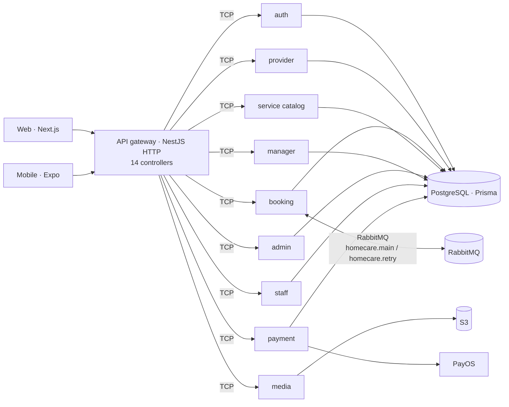

# Home Care 360 — backend platform

A home-services marketplace: customers book cleaning, elderly care and repairs;
providers publish services, manage staff and take bookings; managers approve
providers and services and settle reports and withdrawals. FPT University
capstone project, 2024–2025, team of four. Backend services by
[@tientran1234](https://github.com/tientran1234).

This repository is the NestJS monorepo (`apps/` + `libs/common`) from which
the per-service repositories in this organization were split for deployment.

## Architecture



- One entry point: the gateway owns HTTP, JWT verification and role checks,
  then forwards each request to a service as a NestJS message pattern over TCP.
- Services own their data: each has its own Prisma schema and database.
- Booking publishes events to RabbitMQ with a retry queue, so a failed
  downstream step is retried instead of lost.
- Media never proxies bytes: it hands the client a presigned S3 URL.
- Payments go through PayOS; the payment service confirms by webhook.

## Services

| Repository | Framework | Owns |
|---|---|---|
| [BE_GATEWAY_SERVICE](https://github.com/HOME-CARE-360/CAPSTONE_HOME_CARE_BE_GATEWAY_SERVICE) | NestJS (HTTP) | routing, auth guards, 159 routes in 14 controllers |
| [BE_AUTH_SERVICE](https://github.com/HOME-CARE-360/CAPSTONE_HOME_CARE_BE_AUTH_SERVICE) | NestJS (TCP) | register, login, OTP, refresh tokens, Google sign-in, provider onboarding |
| [BE_PROVIDER_SERVICE](https://github.com/HOME-CARE-360/CAPSTONE_HOME_CARE_BE_PROVIDER_SERVICE) | NestJS (TCP) | services and service items, staff, booking proposals and assignment, reports, withdrawals, dashboard stats |
| [BE_BOOKING_SERVICE](https://github.com/HOME-CARE-360/CAPSTONE_HOME_CARE_BE_BOOKING_SERVICE) | NestJS (TCP + RabbitMQ) | service requests, conversations and messages |
| [BE_SERVICE_SERVICE](https://github.com/HOME-CARE-360/CAPSTONE_HOME_CARE_BE_SERVICE_SERVICE) | NestJS (TCP) | service catalog, categories, suggestions, chat |
| [BE_MANAGER_SERVICE](https://github.com/HOME-CARE-360/CAPSTONE_HOME_CARE_BE_MANAGER_SERVICE) | NestJS (TCP) | categories, provider/service approval, reports, withdrawals |
| [BE_MEDIA_SERVICE](https://github.com/HOME-CARE-360/CAPSTONE_HOME_CARE_BE_MEDIA_SERVICE) | NestJS (TCP) | presigned S3 uploads |
| [BE_ADMIN_SERVICE](https://github.com/HOME-CARE-360/CAPSTONE_HOME_CARE_BE_ADMIN_SERVICE) | Express + TCP handlers | platform administration |
| [BE_STAFF_SERVICE](https://github.com/HOME-CARE-360/CAPSTONE_HOME_CARE_BE_STAFF_SERVICE) | Express + TCP handlers | staff accounts and assignments |
| [BE_PAYMENT_SERVICE](https://github.com/HOME-CARE-360/CAPSTONE_HOME_CARE_BE_PAYMENT_SERVICE) | Express + TCP handlers | PayOS checkout and webhooks |
| [FE-WEB](https://github.com/HOME-CARE-360/CAPSTONE-HOME-CARE-FE-WEB) | Next.js | web app |
| [FE-APP](https://github.com/HOME-CARE-360/CAPSTONE-HOME-CARE-FE-APP) | Expo / React Native | mobile app |

## This repository

```
apps/        auth · gateway · manager · media · provider   (NestJS applications)
libs/common  shared modules — RabbitMQ (main + retry queues), DTOs, guards
k8s/         Helm chart for GKE (Chart.yaml, values.yaml, templates/)
cloudbuild.yaml   Google Cloud Build pipeline
docker-compose.yaml   local dependencies
```

```bash
pnpm install
docker compose up -d
pnpm start:dev gateway        # or auth, provider, manager, media
```

## Deployment

Docker images built by Cloud Build, deployed to Google Kubernetes Engine with
the Helm chart in `k8s/homecare360`.

## Configuration

Read from the environment (names as used in the code; no values are committed):

- `ACCESS_TOKEN_EXPIRES_IN`
- `ACCESS_TOKEN_SECRET`
- `APP_NAME`
- `AUTH_HOST`
- `AUTH_HTTP_PORT`
- `AUTH_TCP_PORT`
- `GATEWAY_HTTP_PORT`
- `GOOGLE_CLIENT_ID`
- `GOOGLE_CLIENT_REDIRECT_URI`
- `GOOGLE_CLIENT_SECRET`
- `GOOGLE_REDIRECT_URI`
- `MANAGER_HOST`
- `MANAGER_HTTP_PORT`
- `MANAGER_TCP_PORT`
- `MEDIA_HOST`
- `MEDIA_HTTP_PORT`
- `MEDIA_TCP_PORT`
- `OTP_EXPIRES_IN`
- `PAYMENT_API_KEY`
- `REFRESH_TOKEN_EXPIRES_IN`
- `REFRESH_TOKEN_SECRET`
- `RESEND_API_KEY`
- `S3_ACCESS_KEY`
- `S3_BUCKET_NAME`
- `S3_ENPOINT`
- `S3_REGION`
- `S3_SECRET_KEY`
- `TCP_PORT`
